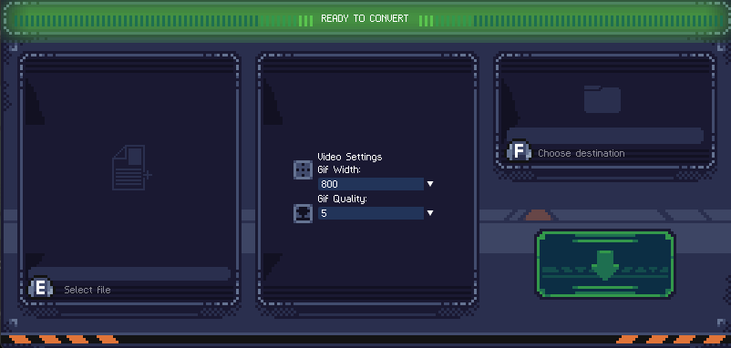

<p align="center">

</p>

<h1 align="center">X-Gif-Maker</h1>

<div align="center">


</div>

_Turn your videos into GIFs in a snap! Customize settings to shrink file sizes, suitable for sharing on social media platforms._

## Introduction

This is a revamped version of my [Twitter-Gif-Maker Tool](https://github.com/bigasdev/Twitter-Gif-Maker), which I originally created a while back to support my game development posts on Twitter.

The purpose of this project was to refine and test my work-in-progress framework called Fortress, and to optimize the tool with an elegant interface for easier usability.


<div style="text-align:center">
<small>This gif was created with X-Gif-Maker!</small>
</div>

## Features



-   Straightforward usage: simply drag and drop your file or select it to convert it to a .gif format, saving it to any folder.
-   Options to adjust your .gif quality and width.
-   Shortcut keys provided for all actions for quick iterations.
-   Utilizes multithreading to prevent the program from becoming unresponsive during video conversion.
-   Beautiful pixel-art UI.

## Feedback

Feel free to send feedback on [Twitter](https://x.com/bigasdev) or file an issue. Feature requests are always welcome.

If there's anything you'd like to chat about, please feel free to message me at [Discord]()!

## Build Process

You can grab the tool from the Releases section. However if you prefer to check the source code and compile it yourself its pretty simple.

Currently, the tool is only compatible with Windows. If you are using Windows, ensure that you have [gcc 13.2.0+](https://gcc.gnu.org/gcc-13/) installed.

After cloning the repository, execute the setup.bat file located in the scripts_dlls folder to configure your .debug and .release folders with the necessary DLLs and resources.

The SDL and other libraries I use are included in the source code, so you only need to run the following commands to build from the Makefile:

```
mingw32-make -j debug
or
mingw32-make release DEBUG=false
```

For the release version, I recommend utilizing the **ship.bat** located within the _scripts_dlls folder_, which generates the complete .release folder for you.

Following the release compilation, you can locate the **modern_installer.nsi** file inside the _scripts_dlls_ folder, which allows you to generate a nice NSIS installer.

For VSCode users the project has a [commandbar](https://marketplace.visualstudio.com/items?itemName=gsppvo.vscode-commandbar) setup.


## Acknowledgments

A huge thanks to [NabiKAZ](https://github.com/NabiKAZ) for creating [video2gif](https://github.com/NabiKAZ/video2gif?tab=readme-ov-file), which enables this quick and easy GIF conversion.

And of course, thanks to the [FFmpeg project](https://github.com/FFmpeg/FFmpeg)
